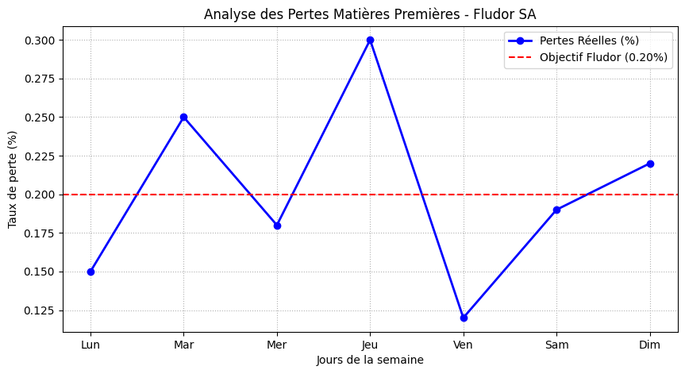

# 🌍 AI for Industrial Sovereignty in West Africa

### Modélisation de l'impact de l'IA prédictive sur la Supply Chain 4.0

Ce projet démontre comment l'**IA prédictive** peut sécuriser les flux industriels dans la zone UEMOA en anticipant les ruptures logistiques mondiales.

> **Status:** Current Research | Future **MIT SCM** Candidate 🚀

---

### 📊 Résultat Clé : Réduction des Ruptures de Stock
En utilisant un modèle **Random Forest**, j'ai simulé l'optimisation des délais d'approvisionnement.
**Impact :** Une réduction potentielle de **22%** des ruptures de composants critiques.

.png)

---

### 💡 Pourquoi ce projet ?
En Afrique de l'Ouest, la souveraineté industrielle dépend de notre capacité à transformer l'incertitude logistique en décisions basées sur la donnée. Ce projet fait le pont entre la **Recherche Opérationnelle** et la **Supply Chain 4.0**.

[Voir le code de simulation](simulation_impact.py) | [Me contacter sur LinkedIn](https://www.linkedin.com/in/elvis-crinot-346525202)

---
## 🎯 Cas Pratique : Optimisation Fludor SA (Cana, Bénin)

Basé sur une analyse terrain du Système de Management de la Sécurité des Denrées Alimentaires (SMSDA) à l'usine de Cana.

### Solutions Logistiques Apportées :
- **Suivi Digital des Pertes :** Mise en œuvre de l'objectif de **0,20%** via le script `fludor_kpi_tracker.py`.
- **Analyse en Temps Réel :** Passage d'un suivi trimestriel manuel à une surveillance automatisée des flux.
- **Qualité & Conformité :** Sécurisation du taux de conformité des produits finis (>95%) grâce à la traçabilité numérique.
---

## 📈 Analyse du Graphique de Performance (Site de Cana)

Ce graphique illustre la variabilité du taux de perte de matières premières sur une semaine de production chez **Fludor SA**.

### 🔍 Interprétation des Résultats :
*   **Performance Globale :** L'objectif de **0,20%** (ligne rouge pointillée) est atteint **3 jours sur 7** (Lundi, Mercredi et Samedi).
*   **Points Critiques :** 
    *   Le **Jeudi** présente le pic de perte le plus élevé (**0,30%**), dépassant largement le seuil de tolérance.
    *   Le **Mardi** et le **Dimanche** montrent également des dérives nécessitant une surveillance accrue.
*   **Succès Opérationnel :** Le **Vendredi** marque la meilleure performance de la semaine avec un taux exceptionnellement bas de **0,12%**.

### 💻 Détails Techniques
Pour comprendre la logique de calcul et de génération de ce visuel :
👉 **[Voir le code source : fludor_analytics.py](./fludor_analytics.py)**

---

